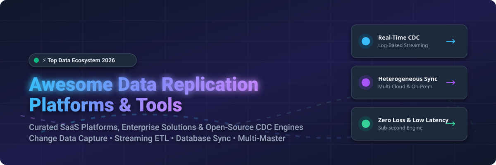

  

# 🚀 Awesome Data Replication Platform

    

---

## 🌐 Top Data Replication Platforms Ecosystem

> **Curated List of SaaS Products & Open-Source GitHub Projects**  
> *Focused on Change Data Capture (CDC), Real-Time Replication, Database Migration & Data Integration*  
> **Last updated: October 2026**

This repository tracks notable **SaaS platforms** and **open-source projects** for **Data Replication**. These enterprise-grade tools help organizations capture changes from production databases in real time, replicate data across heterogeneous systems, and keep data warehouses, search indexes, lakehouses, and microservices continuously in sync.

---

## 📑 Table of Contents

- [📊 Market Overview & Industry Analysis](#-market-overview--industry-analysis)
- [☁️ SaaS & Hosted Data Replication Platforms](#️-saas--hosted-data-replication-platforms)
- [⚡ Open-Source GitHub Projects](#-open-source-github-projects)
- [🛠️ Key Use Cases & Frameworks](#️-key-use-cases--frameworks)
- [🤝 How to Contribute](#-how-to-contribute)
- [⚠️ Disclaimer](#%EF%B8%8F-disclaimer)
- [💖 Support & Sponsorship](#-support--sponsorship)
- [📈 Star History](#-star-history)

---

## 📊 Market Overview & Industry Analysis

> 💡 **Market Size & Structure**: The global data replication and Change Data Capture (CDC) market is estimated at **$2.5 Billion to $3.2 Billion (2026)** with an expected CAGR of **14.5%**. The market is **moderately fragmented**: mega-cap hyperscalers (AWS, Microsoft Azure, Oracle, IBM) and dominant ETL vendors (Qlik, Fivetran) command the top tier for enterprise IT, while specialized, high-performance streaming platforms (Striim) and developer-first open-source engines (Debezium, Airbyte, Sequin) rapidly capture developer adoption.

---

## ☁️ SaaS & Hosted Data Replication Platforms

The table below lists leading SaaS and commercial data replication products sorted by estimated company scale (valuation or annual revenue, descending):

| Platform | Est. Scale / Valuation | Pricing Column | Free Tier Limit | Description & Best For |
| :--- | :--- | :--- | :--- | :--- |
| **[Microsoft Azure Data Factory](https://azure.microsoft.com/en-us/products/data-factory)** | **$3.1T** (Microsoft Mkt Cap) | Starts at **$1.00 per DIU-hour** (Data Integration Unit) for Data Flow execution; **$0.25/hour** for self-hosted IR. | **Free 12 Months**: Includes 50 hours/month of pipeline activity and 1,000 activity runs/month. | Azure-native data integration service with mapping data flows, pipeline orchestration, and built-in CDC connectors. Best for Azure-centric enterprise data teams. |
| **[Oracle GoldenGate](https://www.oracle.com/integration/goldengate/)** | **$480B** (Oracle Mkt Cap) | Starts at **$17.50/hour** per OCPU for GoldenGate Cloud Service (or ~$17,500/core perpetual license on-prem + 22% annual support). | **Always Free Tier**: Oracle Cloud Free Tier includes 2 Autonomous Databases + 30-day trial with **$300 free credits**. | Enterprise replication with industry-standard log-based CDC capabilities. Best for Oracle-heavy enterprise environments with strict high-availability requirements. |
| **[AWS DMS](https://aws.amazon.com/dms/)** | **$2.2T** (Amazon Mkt Cap) | Starts at **$0.018/hour** for single-AZ `dms.t3.micro` instance + standard storage ($0.115/GB-month). | **Free Tier**: **750 hours** of single-AZ `dms.t2.micro` or `dms.t3.micro` instance usage per month for 6 months. | AWS-native database migration and replication service supporting heterogeneous database migrations and continuous CDC replication. |
| **[IBM InfoSphere CDC](https://www.ibm.com/products/infosphere-change-data-capture)** | **$210B** (IBM Mkt Cap) | Enterprise licensing starting around **$12,000 per PVU** (Processor Value Unit) or subscription options. | **30-Day Free Trial**: Full functional evaluation trial via IBM Cloud / Enterprise sales sandbox. | Enterprise log-based CDC platform for heterogeneous replication across mainframe and distributed databases. Provides field-level encryption and detailed audit trails. |
| **[Qlik Replicate](https://www.qlik.com/us/products/qlik-replicate)** | **~$10B** (Thoma Bravo valuation) | Enterprise core-based subscription starting at **~$25,000/year** for base engine. | **30-Day Enterprise Trial**: Hands-on trial available upon enterprise request via Qlik Cloud/on-prem sandbox. | Formerly Attunity Replicate (acquired by Qlik). Provides real-time CDC across 30+ heterogeneous databases with automated schema creation and target loading. |
| **[Fivetran](https://www.fivetran.com/)** | **$5.6B** (Last private valuation) | Starts at **$1.50 per MAR** (Monthly Active Rows) on Free/Standard tier ($5/month minimum per connection since 2026). | **Free Tier**: **500,000 MAR/month** free forever + 14-day unlimited initial free trial. | Fully managed ELT platform with 300+ connectors, automated schema drift handling, and log-based replication. Best for analytics teams seeking zero-maintenance ingestion. |
| **[Precisely Connect](https://www.precisely.com/product/precisely-connect/connect)** | **~$3.5B** (Clearlake Capital) | Enterprise capacity licensing starting at **~$15,000/year** per node. | **14-Day Free Evaluation**: Available upon request for enterprise proof-of-concept testing. | Data integration and CDC platform specialized for mainframes (IBM z/OS, AS400) and distributed cloud target syncing. |
| **[Quest SharePlex](https://www.quest.com/products/shareplex/)** | **~$3.0B** (Clearlake Capital) | Starts at **~$9,500 per source database instance/year**. | **30-Day Unlimited Trial**: Full-featured 30-day software evaluation license. | Oracle-focused replication and data integration platform providing real-time log-based CDC, data validation, and peer-to-peer conflict resolution. |
| **[Striim](https://www.striim.com/)** | **~$1.2B** (Series E valuation scale) | Starts at **$2,500/month** for Developer Cloud tier (or **$0.80/GB** streaming processed). | **30-Day Free Trial**: Striim Cloud free trial with up to **10 million rows/month** processed free during trial. | Real-time streaming data integration and CDC platform supporting sub-second latency, in-flight SQL transformations, and enterprise-grade governance. |
| **[Hevo Data](https://hevodata.com/)** | **~$300M** (Series B scale) | Starts at **$239/month** (billed annually) for 5 Million events/month on Starter Plan. | **Free Forever Tier**: **1 Million events/month** free + 150+ free connectors + 14-day free trial on paid plans. | Managed ELT and CDC platform with 150+ automated connectors, near real-time ingestion, and automated schema mapping. |

---

## ⚡ Open-Source GitHub Projects

Below is a curated list of production-proven open-source data replication tools, sorted by **GitHub Star Count (descending)**. Each badge links directly to the repository's stargazers page:

1. **[Airbyte](https://github.com/airbytehq/airbyte)**   
   **The leading open-source data integration engine.** Supports 300+ pre-built connectors for databases, APIs, and data warehouses with both CDC (via Debezium integration) and batch sync modes. **ELv2 License**.

2. **[Canal](https://github.com/alibaba/canal)**   
   **Alibaba's MySQL binlog incremental subscription and consumption component.** Widely adopted across high-throughput enterprise environments for MySQL-to-Kafka/RocketMQ real-time synchronization. **Apache-2.0**.

3. **[Debezium](https://github.com/debezium/debezium)**   
   **The de facto industry standard for log-based Change Data Capture (CDC).** Captures row-level changes from MySQL, PostgreSQL, SQL Server, Oracle, DB2, and MongoDB, streaming events directly into Apache Kafka or Kafka Connect. Built-in Outbox pattern support for event-driven microservices. **Apache-2.0**.

4. **[Apache Flink CDC](https://github.com/apache/flink-cdc)**   
   **Streaming data integration engine with exactly-once processing semantics.** Integrates directly with Apache Flink for real-time ETL pipelines across MySQL, PostgreSQL, Oracle, MongoDB, and OceanBase without intermediate message queues. **Apache-2.0**.

5. **[CloudQuery](https://github.com/cloudquery/cloudquery)**   
   **High-performance open-source ELT framework written in Go.** Extracts cloud infrastructure metadata and database schemas into PostgreSQL, Snowflake, BigQuery, and ClickHouse using high-concurrency plugins. **MPL-2.0**.

6. **[Meltano](https://github.com/meltano/meltano)**   
   **CLI-first, declarative DataOps framework for ELT pipelines.** Built around the Singer specification, allowing software engineers to version-control data pipelines with Git and deploy via Docker/Kubernetes. **MIT License**.

7. **[Maxwell's Daemon](https://github.com/zendesk/maxwell)**   
   **Lightweight MySQL binlog CDC application by Zendesk.** Reads MySQL binlogs and writes JSON change events to Kafka, Kinesis, RabbitMQ, Redis, or stdout with minimal memory footprint. **Apache-2.0**.

8. **[Sequin](https://github.com/sequinstream/sequin)**   
   **Postgres Change Data Capture to streams and queues without requiring Apache Kafka.** Connects to Postgres logical replication slots, featuring built-in backfills, SQL filtering/routing to SQS, Redis, GCP Pub/Sub, NATS, and Webhooks. **MIT License**.

9. **[SymmetricDS](https://github.com/JumpMind/symmetric-ds)**   
   **Cross-platform, bi-directional database replication and file sync.** Uses database triggers to sync data across thousands of remote nodes (e.g., retail POS terminals) across WANs with multi-master conflict resolution. **GPL-3.0**.

10. **[Estuary Flow](https://github.com/estuary/flow)**   
    **Real-time streaming data integration platform.** Built in Rust for sub-second streaming ETL between cloud databases, streaming queues, and warehouses with strong schema validation. **BSL-1.1**.

11. **[PeerDB](https://github.com/peerdb-io/peerdb)**   
    **Fast Postgres-native data replication engine.** Optimized for replicating Postgres data into ClickHouse, Snowflake, BigQuery, and Queues up to 10x faster than traditional connectors. **BSL-1.1 / Apache-2.0**.

12. **[TiFlow (TiCDC)](https://github.com/pingcap/tiflow)**   
    **PingCAP's CDC and Data Migration platform for TiDB.** Captures real-time key-value changes from TiDB cluster Raft logs and streams them to downstream MySQL, Kafka, or S3 targets. **Apache-2.0**.

13. **[pglogical](https://github.com/2ndQuadrant/pglogical)**   
    **Logical replication extension for PostgreSQL.** Provides publish/subscribe database replication with row-level filtering and conflict resolution, serving as the basis for Postgres native logical replication. **PostgreSQL License**.

14. **[OpenLogReplicator](https://github.com/bersler/OpenLogReplicator)**   
    **High-performance C++ Oracle database CDC log parser.** Reads Oracle redo logs and archive logs directly without agent overhead, streaming JSON payloads to Kafka or RabbitMQ. **GPL-3.0**.

15. **[Ape Data Transfer Suite (Ape-DTS)](https://github.com/apecloud/ape-dts)**   
    **Ultra-fast data replication engine written in Rust.** Supports heterogeneous sync across MySQL, PostgreSQL, Redis, MongoDB, Kafka, and ClickHouse for disaster recovery and migration. **Apache-2.0**.

16. **[pgcapture](https://github.com/replicase/pgcapture)**   
    **Go implementation of Netflix DBLog engine for PostgreSQL.** Provides reliable, scalable zero-downtime table backfills and continuous logical streaming CDC. **Apache-2.0**.

17. **[Tungsten Replicator](https://github.com/continuent/tungsten-replicator)**   
    **High-performance transactional replication engine for MySQL, PostgreSQL, and Oracle.** Supports multi-master topologies, parallel extraction, and global transaction IDs. **Apache-2.0**.

---

## 🛠️ Key Use Cases & Frameworks

* **Kafka-Centric Microservices**: Combine **Debezium** or **Canal** with Apache Kafka and Kafka Connect for asynchronous event-driven architectures.
* **Stream Analytics & Exactly-Once Ingestion**: Deploy **Apache Flink CDC** for direct transformations into ClickHouse, Apache Iceberg, or Delta Lake.
* **Lightweight Postgres Streaming**: Use **Sequin** or **PeerDB** to stream Postgres updates to Redis/SQS/Webhooks without managing Kafka brokers.
* **Multi-Master & Distributed Retail Sync**: Use **SymmetricDS** for edge node database synchronization over unreliable WAN networks.

---

## 🤝 How to Contribute

Contributions are welcome! To add or update entries:

1. **Fork the repository**.
2. **Add or update entries** in `README.md` following the exact table or list format.
3. Ensure all links point to official websites or GitHub repositories.
4. **Submit a Pull Request** with a brief summary of additions.

---

## ⚠️ Disclaimer

- This list is **community-curated** for informational purposes and does not constitute endorsement.
- Data replication tools handle mission-critical production data. Ensure encryption in transit/rest and test failover topologies in staging.

---

## 💖 Support & Sponsorship

If you find this repository helpful, please consider supporting the project:

- 🌟 **Star this repository** to help others discover it.
- 🔀 **Fork & Share** it with fellow data engineers and developers.
- ☕ **Buy me a coffee**: Support ongoing curation on the [GitHub Sponsor Dashboard](https://github.com/sponsors/ishandutta2007).

---

## 📈 Star History

